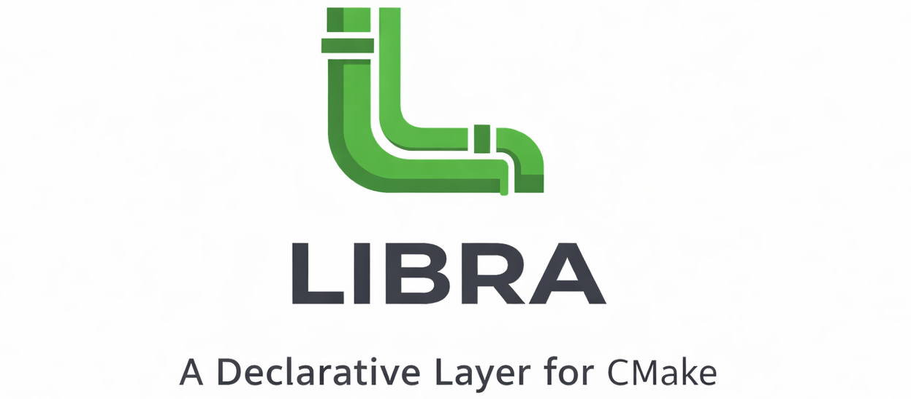

.. SPDX-License-Identifier: MIT

.. |docs| image:: https://img.shields.io/badge/docs-github.io-blue
   :target: https://jharwell.github.io/libra
   :alt: Documentation

.. |ci-master| image:: https://github.com/jharwell/libra/actions/workflows/ci.yml/badge.svg?branch=master

.. |ci-devel| image:: https://github.com/jharwell/libra/actions/workflows/ci.yml/badge.svg?branch=devel

.. |license| image:: https://img.shields.io/github/license/jharwell/libra

.. |platform| image:: https://img.shields.io/badge/platform-linux%20%7C%20macos-lightgrey
   :alt: Platform

.. |cmake| image:: https://img.shields.io/badge/cmake-%3E%3D3.31-blue
   :alt: CMake

.. |compiler| image:: https://img.shields.io/badge/compilers-gcc%20%7C%20clang%20%7C%20intel-blue
   :alt: Compilers

.. |version-master| image:: https://img.shields.io/github/v/tag/jharwell/libra?filter=!*.beta*&label=master&sort=semver
   :target: https://github.com/jharwell/libra/releases
   :alt: Latest release tag

.. |version-devel| image:: https://img.shields.io/github/v/tag/jharwell/libra?filter=*-*&include_prereleases&label=devel&sort=semver
   :target: https://github.com/jharwell/libra/releases
   :alt: Latest devel tag

+-----------------------------------+----------------------------------+
|Usage                              | |docs| |cmake|                   |
|                                   | |compiler| |platform|            |
+-----------------------------------+----------------------------------+
|Release                            | |ci-master| |version-master|     |
+-----------------------------------+----------------------------------+
|Development                        | |ci-devel| |version-devel|       |
+-----------------------------------+----------------------------------+
| Miscellaneous                     | |license|                        |
+-----------------------------------+----------------------------------+

================================
Luigi Builds Reusable Automation
================================

LIBRA is a declarative CMake framework that standardizes compiler flags,
testing, analysis, and packaging for C/C++ projects with near-zero
configuration.

* **Near-Zero Boilerplate:** Define your project in just a few lines of CMake.
* **Secure by Default:** Automatic hardening flags and sanitizers.
* **Unified Tooling:** One interface for GCC, Clang, and Intel compilers.
* **Quality Tooling Built-In:** Native targets for coverage, analysis, and docs.

Keywords: CMake framework, C/C++ build automation, sanitizers, coverage,
static analysis, reproducible builds

How LIBRA Works
===============

LIBRA is a collection of CMake modules that:

#. Define opinionated, best-practice defaults
#. Auto-discover sources and tests
#. Generate standard quality targets

You still write CMake, but far less of it; LIBRA layers on top of CMake.  *It
does not replace your build system.*

Why Use LIBRA?
==============

* You maintain multiple C/C++ projects with similar build needs.
* You want consistent builds across compilers.
* You are tired of copy-pasting CMake boilerplate.
* You need reproducible builds with modern defaults.
* You want tests and quality tooling with minimal effort.

Why Not Use LIBRA?
==================

LIBRA prioritizes consistency and automation over maximal flexibility. You may
want to choose a different approach if:

* You use non-CMake build systems.
* You require Windows/MSVC.
* You depend on exotic or unsupported toolchains.
* You need per-file compiler flag micromanagement.

Quick Example
=============

**Before LIBRA (Standard CMake):**

.. code-block:: cmake

   # 50+ lines to set up:
   # - Compiler flags for Debug/Release
   # - Sanitizer configuration with compiler detection
   # - Code coverage setup
   # - Test discovery and CTest integration
   # - Static analysis targets
   # ... (boilerplate continues)

**After LIBRA:**

.. code-block:: cmake

   # CMakeLists.txt (4 lines)
   cmake_minimum_required(VERSION 3.31)
   find_package(libra REQUIRED)
   project(myproj CXX)
   include(libra/project)

.. code-block:: cmake

   # cmake/project-local.cmake (2 lines)
   libra_add_executable(${${PROJECT_NAME}_CXX_SOURCE})
   set(LIBRA_SAN "ASAN+UBSAN")  # Sanitizers on any compiler

**Build:**

.. code-block:: bash

   cmake -B build -DLIBRA_TESTS=ON -DLIBRA_CODE_COV=ON -DLIBRA_DOCS=ON
   make -C build analyze                     # Run all static analysis tools
   make -C build build-and-test gcovr-report # Tests run + coverage report generated
   make -C build apidoc                      # Build API documentation
   make -C build format                      # Format all source files

Key Features And Architecture
=============================

* Unified compiler abstraction
* Sanitizers (ASAN, UBSAN, TSAN, MSAN, SSAN)
* Static analysis (clang-check, clang-tidy, cppcheck)
* Coverage (gcovr, llvm-cov)
* Profile-guided optimization (PGO)
* Automatic source file and test discovery and registration
* Robust compiler warnings

All of the above comes "for free" with a project layout like this::

   my_project/
   ├── CMakeLists.txt              # Minimal: find_package + project()
   ├── cmake/
   │   └── project-local.cmake     # Your targets and configuration
   ├── docs/
   │   └── Doxyfile.in             # Your API doc configuration
   ├── src/                        # Auto-discovered source files
   ├── include/                    # Auto-discovered headers
   ├── tests/                      # Auto-discovered tests (*-{u,i,r}test.{c,cpp})
   └── build/                      # Build artifacts (git-ignored)

At a high level, LIBRA works like this:

.. figure:: docs/figures/arch.png

Installation
============

**Option A: Install via conan**

.. code-block:: bash

   git clone https://github.com/jharwell/libra
   conan create .

**Option B: CPM (Cmake Package Manager)**

.. code-block:: cmake

   file(DOWNLOAD
        https://github.com/cpm-cmake/CPM.cmake/releases/download/v0.40.2/CPM.cmake
        ${CMAKE_CURRENT_BINARY_DIR}/cmake/CPM.cmake)
   set(CPM_SOURCE_CACHE
       $ENV{HOME}/.cache/CPM
       CACHE PATH "CPM source cache")
   include(${CMAKE_CURRENT_BINARY_DIR}/cmake/CPM.cmake)
   cpmaddpackage(
     NAME
     libra
     GIT_REPOSITORY
     https://github.com/jharwell/libra.git)

**Option C: Install system-wide**

.. code-block:: bash

   git clone https://github.com/jharwell/libra
   cmake -S libra -B build
   cmake --build build --target install

**Option D: git submodule**

.. code-block:: cmake

   git submodule add libra https://github.com/jharwell/libra

FAQ
===

**Does LIBRA replace CMake?**
No. LIBRA is a layer on top of CMake that adds conventions and automation.

**Can I mix LIBRA and plain CMake targets?**
Yes. Generally speaking, only targets created with ``libra_*`` macros receive
LIBRA features.

**Is globbing mandatory?**
No. You may override discovery with explicit source lists.

**Does LIBRA enforce its project layout?**
LIBRA assumes conventional layouts by default, but most paths are configurable.

**Can I disable individual features?**
Yes. All major features (sanitizers, coverage, analysis, docs) are opt-in.

Requirements
============

Platform: Linux/Unix, macOS

Build Tools: CMake >= 3.31

Compilers: GCC >= 9, Clang >= 14, Intel >= 2025.0
