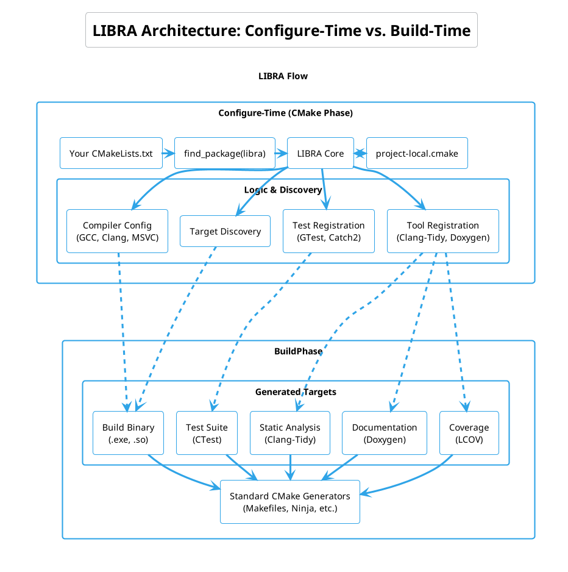

.. SPDX-License-Identifier: MIT

.. _main:

=======================================
LIBRA (Luigi Build Reusable Automation)
=======================================

LIBRA is a reusable build framework for C/C++ projects built on top of CMake.
It transforms the build process from manual scripting into a **declarative workflow**,
providing compiler abstraction and near-zero boilerplate configuration.

.. IMPORTANT::
   **Core Goal:** To make building complex C++ projects as simple as
   declaring intent (e.g., "I want a library with coverage") rather than
   writing imperative CMake logic.

Who Should Use LIBRA
====================

* **Platform Engineers** looking to standardize build quality across multiple repositories.
* **C++ Developers** who want to focus on code rather than debugging ``.cmake`` modules.
* **Teams** requiring consistent "push-button" integration for Sanitizers, Static Analysis, and Documentation.

Design Philosophy
=================

* **Convention over Configuration:** Standardized project layouts mean zero setup for new repos.
* **Declarative Intent:** Focus on *what* to build (e.g., ``libra_add_library()``), not *how* to set compiler flags.
* **Toolchain Agnostic:** A single configuration should work across GCC, Clang, and Intel LLVM without ``if(MSVC)`` blocks.

Architecture Overview
=====================

This diagram shows which parts of LIBRA are active during CMake configuration
and which parts are active when build targets are executed.

Features & Capabilities
=======================

Configure Time (Setup Logic)
----------------------------
During the ``cmake ..`` phase, LIBRA automates the heavy lifting:

* **Security & Hardening:** Automatic injection of stack protectors, fortify-source, and control-flow integrity flags.
* **Quality Gates:** Seamless setup for **Clang-Tidy**, **Cppcheck**, and custom linters.
* **Dependency Orchestration:** Smart globbing for source discovery that respects build-system boundaries.
* **Environment Discovery:** Automatic detection and registration of tests and source files.

Build Time (Execution Targets)
------------------------------
LIBRA injects standardized targets into your build system (Ninja/Make):

* ``make analyze``: Run the full suite of configured static analyzers.
* ``make format``: Apply project-wide formatting via Clang-Format.
* ``make docs``: Generate API documentation (Doxygen/Sphinx).
* ``make coverage``: Generate HTML/XML coverage reports (LCOV/Gcovr).

Integration Modes
=================

LIBRA scales with your project's complexity. Choose the mode that fits your infrastructure:

1. **Conan Middleware (Recommended):** The most robust path. LIBRA acts as a Conan build helper.
2. **Standard CMake Package:** Integrated via ``find_package(libra)``.
3. **In-Situ (Submodule):** Drop LIBRA directly into your source tree.

How to Use These Docs
=====================

.. toctree::
   :maxdepth: 1
   :caption: Getting Started

   startup/index.rst

.. toctree::
   :maxdepth: 1
   :caption: LIBRA Feature Reference

   usage/index.rst

.. toctree::
   :maxdepth: 1
   :caption: LIBRA Design And Customization

   design/index.rst
